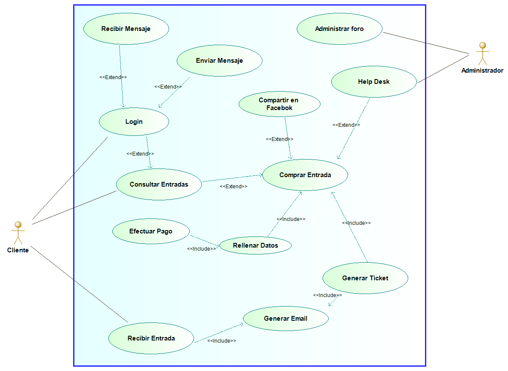

# EnterEvents

App designed to sell tickets from an ice skating rink. Using GOOGLE user authentication and firebase database. PAYPAL used to manage the payments.

The app has the option to share your bought tickets in social networks and to open a QR code with a token that can be used to enter the ice skating place.

## Design
Use case diagram:

Class diagram:

